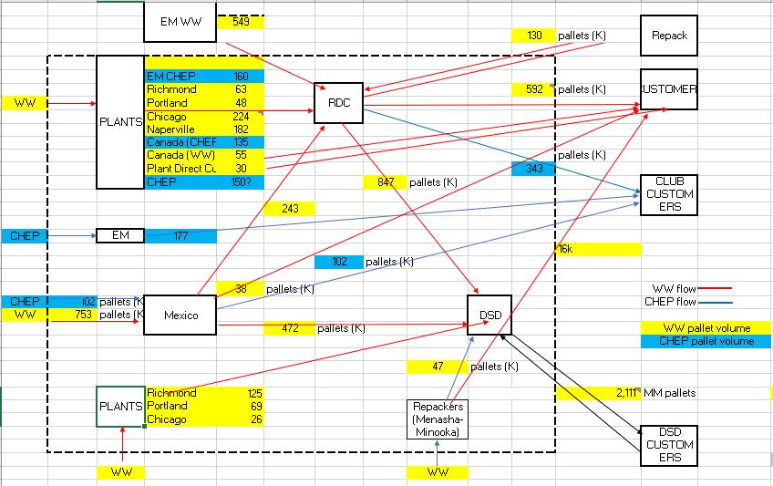

# MDLZ-Pallet-Simulation
Comprehensive simulation of pallet flow through the US CS&amp;L network, including a pallet return program. This initiative was sponsored by Michael Hall in order to simulate and detail the Mondelez network with the use of new and improved pallets that will roll out early 2024.

## Installation
This project was built entirely in the Python programming language. Below are the required dependendices the model needs in order to run properly:

**Editor Used:** VS Code  
**Python Version:** 3.11.9

### Python Packages Used

**Simulation:**
* Simpy 4.0.2 - docs: https://simpy.readthedocs.io/en/4.0.2/

**Data Wrangling/Output:**
* pandas 1.5.3 - docs: https://pandas.pydata.org/pandas-docs/version/1.5.3/getting_started/index.html
* numpy 1.24.3 - docs: https://numpy.org/doc/1.24/

**Reproducibility:**
* random 3.12.1 - docs: https://docs.python.org/3/library/random.html

## Simulation Overview
The pallet simulation model uses the SimPy discrete event simulation framework to simulate pallet flow through the NA MSC network. In our current state, we use a combination of generic whitewood pallets and CHEP pallets to supply our NA MSC network. The logistics operations team are investing new, more stable white wood pallets to replace the current flow of generic white wood pallets throughout the network. These new pallets have the ability to be recycled through the network between 3-5 times, giving Mondelez the opportunity to return them throughout the network in lieu of continuously sourcing new pallets from suppliers. This simulation serves as the guide for injecting these new pallets into the network and following them through the pallet return program over time.

The insights gleaned from this simulation include:
* Where, when and how many pallets will need to be sourced from suppliers in order to meet pallet demand.
* Costs associated with the pallet return program including calculation of number of trucks needed.
* Network pallet health at any location at any point in time.
* Flagging pallet surplus throughout the network at any point in time.
* Tracking pallet attrition via damage and loss to customers.

The network is defined as follows:

**Nodes:**
The nodes in this simulation are split into two categories: Upstream and Downstream.

*Upstream*  
Upstream facilities represent sites that will be the source of both pallet injection and pallet return. These sites include bakeries, external manufacturers & repack facilities.

* US Plants - US bakeries
  * Richmond, VA
  * Portland, WA
  * Chicago, IL
  * Naperville, IL

* Mexico Hub
  * Salinas, MX facilities - *one node for all Salinas facilities*

* *EM's & Repack were initailly included, but have since been excluded per the operations team request.*

*Downstream*  
Downstream facilities represent sites that will accept pallets from upstream facilities and/or distrubte pallets throughout the network. These sites include RDCs, DSD branch locations & customer locations. 

* US DSD Branches - *one node for all branches*
* US RDCs - *one node for all RDCs*
* DSD customers - *one node for all customers*
* Customers (non-DSD) - *one node for all customers*
* Club customers - *one node for all customers*

*Depiction of directional pallet flow in pallet simulation*

**Process:**  
Below is the general flow of how the simulation works:

Initially, each of the upstream nodes are injected with pallets. Since the simulation runs on a weekly basis, this means each upstream node holds a weeks worth of outbound pallet demand when the simulation begins.

Every week, the simulation sends out a weeks worth of pallet demand out of upstream nodes and transfers them to downstream nodes (i.e from Mexico to RDCs). Downstream nodes then send pallets to other downstream nodes (i.e from RDCs to DSD branches). All of these pallet movements happen concurrently as the simulation continues to run, week by week.

As the simulation continues to run, pallet surplus starts to build in the DSD branch locations. At weekly intervals, the simulation checks to see if there is any pallet surplus that can be returned to upstream nodes (US Plants). This surplus is then distributed to upstream nodes and returned via the pallet return program. Upstream nodes ONLY buy new pallets from suppliers every week if the pallet return program can't cover their weekly outbound pallet demand.

The simulation runs out 3 years, and tracks daily information for each upstream node including pallet counts, pallet needs and pallet returns.

## Simulation Technical Details
The SimPy framework has many nuances not detailed in this section. Please reference the docs above for clarification.

The pallet simulation uses six main features of the SimPy framework: Environmnets, Classes, Processes, Resources, Containers & Timeouts.

*Environmnets*
* A SimPy environment is a latent control mechanism in which the entire simulation runs. The environment tracks everything related to the simulation including processes, resources and containers. It also controls how processes are triggered and executed over time.

*Classes*
* Classes are used to define entities within the simulation. In this case, our defined classes represent upstream nodes. These are true python classes and as such, they contain attributes and functions that help the simulation run.

*Processes*
* Processes are python generator functions that are executed throughout the simulation. These generator functions are the executables that move pallets from node to node. This includes all movements related to outbound pallets and inbound return pallets.
  * **IMPORTANT NOTE:** Python Generator objects use the *yield* statement to control their flow. These are much different than general python functions. Before making any modifications to processes, make sure you read the python docs for generators: https://docs.python.org/3/c-api/gen.html

*Resources*
* Resources are variables defined within our classes that allow the simulation to interact with the class' attributes. Once a resource is requested, processes run to give or take pallets out of a respective node's class based on the processes that are defined.

*Containers*
* Containers are an attribute of the upstream nodes. These are latent buckets that hold a specific amount of pallets. These are the buckets that pallets are taken out of and put into as the simulation runs and processes interact with the environment.

*Timeouts*
* Timeouts are python generator functions that delay the simulation for a specified period of time. In the pallet simulation model, we use timeouts to simulate pallet in transit times, holding times etc. Timeouts DO NOT stop the entire simulation from running, but they hault the process in which they are defined for the specified period of time.

**Process:**  
The SimPy framework uses two methods to move pallets throughout the network via interacting with the upstream node's container objects. These methods are *put* and *get*.

A *get* method takes a specified number of pallets out of a container, while a *put* method puts a specified amount of pallets into a container.

To start, all upstream nodes are initialized with a week's worth of pallet demand. When the simulation starts, all upstream nodes start to send pallets out to downstream nodes through the following functions:

**US Plants**  
*richmond_to_dsd* - Process that sends pallets directly from Richmond bakery to dsd locations  
*richmond_to_rdc* - Process that sends pallets from Richmond bakery to RDC locations

*portland_to_dsd* - Process that sends pallets directly from Portland bakery to dsd locations  
*portland_to_rdc* - Process that sends pallets from Portland bakery to RDC locations

*chicago_to_dsd* - Process that sends pallets directly from Chicago bakery to dsd locations  
*chicago_to_rdc* - Process that sends pallets from Chicago bakery to RDC locations

*naperville_to_rdc* - Process that sends pallets from Naperville bakery to RDC locations

**Mexico**  
*mexico_to_dsd* - Process that sends pallets directly from Mexico to DSD locations  
*mexico_to_rdc* - Process that sends pallets from Mexico to RDC locations  
*mexico_to_customers* - Process that sends pallets directly from Mexico to non DSD customer locations

**External Manufacturers (EMs)**  
*em_to_rdc* - Process that sends pallets from EMs to RDC locations

**Repack**  
*repack_to_dsd* - Process that sends pallets directly from Repack to DSD locations  
*repack_to_customers* - Process that sends pallets directly from Repack to non DSD customer locations

All of these processes run concurrently every 7 days, moving pallets in and out of nodes in the network as they flow from upstream nodes to downstream nodes. Throughout this process, pallets are tracked based on which recycled turn they are on, accounting for damage and pallet loss parameters that are set in the simulation.

Within these processes is logic that tracks pallet need at each location and determines whether weekly pallet demand can be covered by the pallet return process or if the location must source pallets from a supplier to cover their demand. 

These return processes are run every 7 days, offset from outbound processes by 4 days (i.e if the outbound processes run on day 21, return processes are run on day 25). The return processes check the pallets available to return buckets to see how much of each location's pallet need can be covered through the pallet return process.
* **IMPORTANT NOTE:** This specific model has been tuned with the following parameters
  * Mexico will ALWAYS source their weekly demand from suppliers. These pallets will eventually become part of the pallet return program for US Plant's use.
  * Pallets that are sent from EMs & Repack are NOT eligible for the pallet return program
  * US Plants are the only upstream nodes participating in the pallet exchange program. Any and all pallets that are eligible to return will be sent to these upstream nodes only.

There is one return process for each US Plant's upstream node:  
*dsd_return_richmond* - Process that returns excess pallets in DSD locations back to Richmond Bakery  
*dsd_return_portland* - Process that returns excess pallets in DSD locations back to Portland Bakery  
*dsd_return_chicago* - Process that returns excess pallets in DSD locations back to Chicago Bakery  
*dsd_return_naperville* - Process that returns excess pallets in DSD locations back to Naperville Bakery

**Running the simulation:**  
The simulation has many flexible parameters that can be adjusted before being run. These parameters are as follows:

*Classes*
* initial_pallets - The number of pallets each location starts with before the simulation begins (default = 1 week of pallet demand)

*Pallet throughput*
* X_PALLETS - Set the number of yearly pallet demand for any location (i.e RICHMOND_PALLETS = 200)

*Lead times*
* PLANTS_TO_RDC - Time it takes for pallets to move from US Plants to the RDCs in days (default = random between [5,7])
* PLANTS_TO_DSD - Time it takes for pallets to move from US Plants to the DSD branches in days (default = random between [5,7])

* SALINAS_TO_RDC - Time it takes for pallets to move from Mexico to the RDCs in days (default = random between [10,14])
* SALINAS_TO_DSD - Time it takes for pallets to move from Mexico to the DSD branches in days (default = random between [10,14])
* SALINAS_TO_CUSTOMERS - Time it takes for pallets to move from Mexico directly to non DSD customers in days (default = random between [10,14])

* RDC_TO_DSD - Time it takes for pallet to move from RDCs to DSD branches in days (default = random between [4,5])
* RDC_TO_CUSTOMER - Time it takes for pallet to move from RDCs to non DSD customers in days (default = random between [2,4])

* DSD_TO_CUSTOMER - Time it takes for pallets to move from DSD branches to DSD customers in days (default = 2)

* REPACK_TO_DSD - Time it takes for pallets to move from Repack to DSD branches in days (default = random between [5,7])
* REPACK_TO_CUSTOMERS - Time it takes for pallets to move from Repack to non DSD customers in days (default = random between [5,7])

* END_TO_PLANT - Time it takes to return pallets from DSD branches to upstream US Plants in days (default = random between [10,14]

*Holding times*
* PLANTS_HOLDING_TIME - Time pallets sit before they can be moved out of US Plants in days (default = random between [7,8])

* RDC_HOLDING_TIME - Time pallets sit before they can be moved out of RDCs in days (default = random between [14,28])

* DSD_HOLDING_TIME - Time pallets sit before they can be moved out of DSD branches in days (default = random between [7,10])

*Distribution Percentages*
* RDC_TO_DSD_DIST - Percentage of RDCs weekly demand requested from DSD branches (default = 0.54)
* RDC_TO_CUSTOMER DIST - Percentage of RDCs weekly demand requested from non DSD customers (default = 0.38)
* RDC_TO_REPACK DIST - Percentage of RDCs weekly demand requested from Repack (default = 0.08)

*Pallet loss and damage*
* PALLET_LOSS_RATE - fixed percentage of each batch of pallets lost for all turns (default = 0.06)

* PALLET_DAMAGE_RATE_T1 = percentage of each batch of turn one (new) pallets lost due to damage (default = 0.04)
* PALLET_DAMAGE_RATE_T2 = percentage of each batch of turn two pallets lost due to damage (default = 0.08)
* PALLET_DAMAGE_RATE_T3 = percentage of each batch of turn three pallets lost due to damage (default = 0.16)
* PALLET_DAMAGE_RATE_T4 = percentage of each batch of turn four pallets lost due to damage (default = 0.32)
* PALLET_DAMAGE_RATE_T5 = percentage of each batch of turn five pallets lost due to damage (default = 0.64)

*Costs*
* RETURN_TO_PLANTS_COST - Dollar value for one full truckload of pallets to be returned from DSD locations back to US Plants (default = $2100)

* STRINGER_COST - Dollar value for sourcing a single brand new stringer pallet (default = $7)
* BLOCK_US_COST - Dollar value for sourcing a single brand new block white wood pallet in the US (default = $22)
* BLOCK_MEXICO_COST - Dollar value for sourcing a single brand new block white wood pallet in Mexico (default = $19)

*Pallet recyclibility*
* turns - Number of times a single block white wood pallet is able to turn through the network before being destroyed (default = 3)

Once all parameters are set, the simulation setup and run is simple:

Step 1) define the environment in which the simulation will run  
Step 2) instantiate upstream node classes with desired parameters  
Step 3) set number of turns each pallet can be recycled through the network  
Step 4) process outbound and return functions every 7 days for desired time period  
Step 5) run the simulation

## Data
All input data for the production model was sourced from the project sponsor. Historical data was used to provide estimates for 2024 pallet throughput at each node in the simulation. This data can be found in the file below:

**Update** - 2025 pallet throughput was forecasted using a Prophet time series forecasting model for each location. This script for this is also found within this repository.

Pallet Simulation Data.xlsx
* Directional yearly pallet throughput for each node in the simulation
* Lead times between nodes in the network
* Holding times due to processing, customs, etc. at each node
* Costs associated with each leg of the pallet return process
* Pallet damage/loss rates by turn
* Truck fill capacity

## Code Structure
All code for this project is written and run in a single jupyter notebook file: *pallet_simulation_2025.ipynb*

**Sections**  
*Imports*
* Python package imports necessary for model to run

*Inputs*
* Section dedicated to providing flexible model parameters described above.

*Class Definition*
* Section for defining all upstream nodes in the simulation with relevant parameters/functions.

*Processes*
* Section for defining all necessary processes needed for the simulation to run properly.

*Simulation Set Up & Run*
* Section that instantiates all classes and necessary parameters, and then runs the simulation inside of the defined environment.

*Output Files*
* Final section that rolls everything up into three separate dataframes and outputs them to csv files:
  * returns_by_location.csv

## Visualizations
EOP Pallet Report uses the pallet simulation output to present theoretical pallet ingestion pacing for the operations team.

Link: https://app.powerbi.com/groups/7f31de24-56ed-4b17-9f75-a649e2457b34/reports/d7f032b9-ea48-4876-83e9-aa6c36ec78c1?ctid=18a01ad8-9727-498a-a47d-17374c6fd9f7&pbi_source=linkShare
